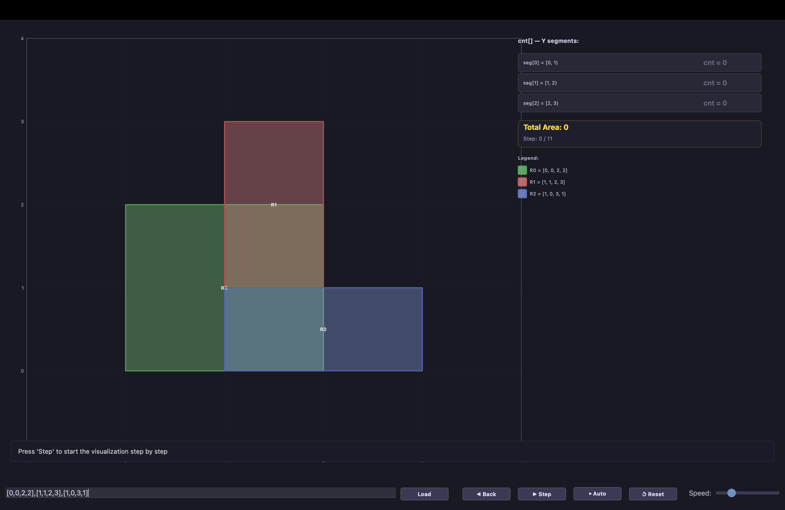
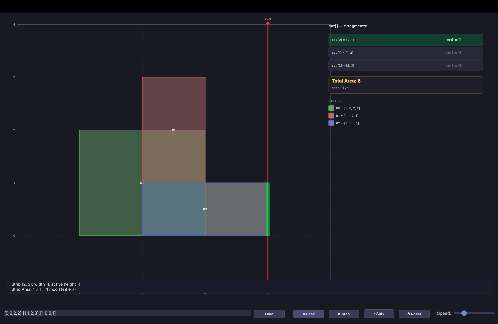

# Rectangle Area II — Sweep Line Visualization

Interactive Qt visualization of the **Sweep Line algorithm** for computing the total area covered by a union of axis-aligned rectangles ([LeetCode 850](https://leetcode.com/problems/rectangle-area-ii/description/)).

---

## Problem

Given a list of axis-aligned rectangles `rectangles[i] = [x1, y1, x2, y2]` where `(x1, y1)` is the bottom-left corner and `(x2, y2)` is the top-right corner, compute the **total area** covered by all rectangles combined. Each point in the plane is counted only once, even if covered by multiple rectangles. Return the result **modulo 10⁹ + 7**.

## Algorithm: Coordinate Compression + Sweep Line
### Core Idea

A vertical **sweep line** moves left to right. At each position, we track which Y-segments are covered. The area contribution of each vertical strip is `width × active_height`.

### Steps

**1. Coordinate Compression**

Extract all unique Y-coordinates from rectangle edges. These define Y-segments `[yVals[i], yVals[i+1])`. Instead of working with coordinates up to 10⁹, we work with at most 2N segments.

**2. Event Creation**

Each rectangle generates two events:
- **START** at `x = x1` — begin covering Y-interval `[y1, y2)`
- **END** at `x = x2` — stop covering Y-interval `[y1, y2)`

Events are sorted by X-coordinate.

**3. Sweep**

Process events left to right. Maintain a `cnt[]` array where `cnt[i]` counts how many rectangles currently cover segment `i`.

For each strip between consecutive X-coordinates:

```
strip_area = (x_next - x_current) × Σ height(seg[i]) for all i where cnt[i] > 0
```

### Complexity

| | Time | Space |
|---|---|---|
| Compression | O(N log N) | O(N) |
| Events | O(N log N) | O(N) |
| Sweep | O(N²) | O(N) |
| **Total** | **O(N²)** | **O(N)** |

For the constraint N ≤ 200, this runs instantly.

---

## Project Structure

```
Rectangle_Area_II/
├── algorithm_solution.h       # Pure C++ — data structures & class declaration
├── algorithm_solution.cpp     # Pure C++ — sweep line implementation
├── mainwindow.h               # Qt visualization — header
├── mainwindow.cpp             # Qt visualization — drawing & controls
├── mainwindow.ui              # Qt Designer file (minimal)
├── main.cpp                   # Entry point + dark theme
├── CMakeLists.txt             # Build configuration
├── screenshots/               # Screenshots for README
└── README.md
```

## Building & Running

### Prerequisites

- C++17 compiler
- Qt 5.15+ or Qt 6.x
- CMake 3.16+

### Build

```bash
mkdir build && cd build
cmake ..
make
./Rectangle_Area_II
```

## Visualization Features

### Interactive Controls

| Control | Action |
|---|---|
| **Text Input** | Enter rectangles: `[x1,y1,x2,y2],[x1,y1,x2,y2],...` |
| **Load** | Parse input and reset visualization |
| **◀ Back** | Step backward |
| **▶ Step** | Advance one algorithm step |
| **⏵ Auto** | Auto-play all steps |
| **↺ Reset** | Return to initial state |
| **Speed** | Control auto-play speed |

### What the Visualization Shows

- **Left panel** — Coordinate grid with colored rectangles
- **Red sweep line** — Current X position, moves left to right
- **Yellow strips** — The strip whose area is being computed in the current step
- **Green bars on sweep line** — Active Y-segments (`cnt[i] > 0`)
- **Right panel** — `cnt[]` array with segment intervals, lights up green when active
- **Total Area** — Running total with mod 10⁹+7 result
- **Step description** — Text explaining what happens at each step

### Input Format

The parser is flexible — all of these work:

```
[0,0,2,2],[1,1,3,3]
[[0,0,2,2],[1,1,3,3]]
0,0,2,2;1,1,3,3
0 0 2 2, 1 1 3 3
```

Any sequence of integers is grouped into sets of four `(x1, y1, x2, y2)`.

---

## Screenshots

<table>
  <tr>
    <td><b>Initial state</b></td>
    <td><b>Sweep line at x=3 (Step 9/11)</b></td>
  </tr>
  <tr>
    <td></td>
    <td></td>
  </tr>
  <tr>
    <td>Rectangles loaded, cnt[] all zeros, <br/>ready to step through the algorithm.</td>
    <td>Sweep line reached x=3. Green bar shows <br/>active segment [0,1). Total Area = 6.</td>
  </tr>
</table>

### Demo


